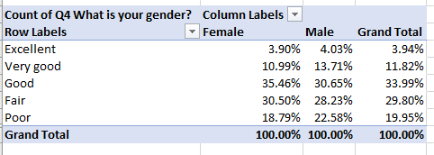
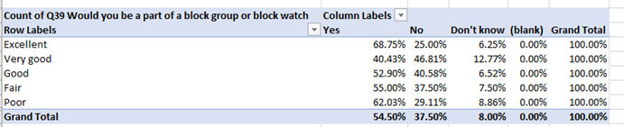
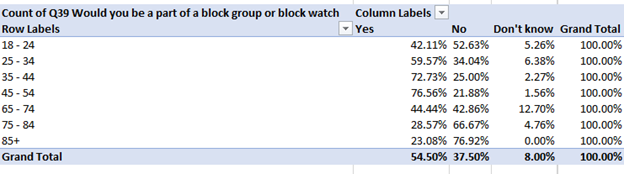
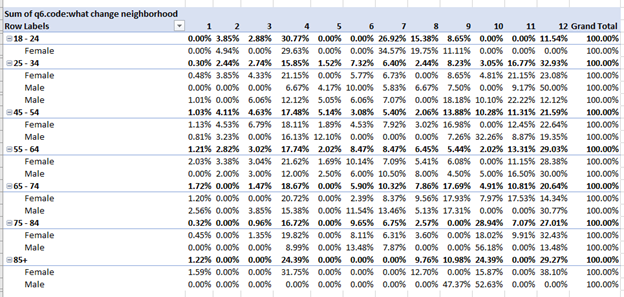
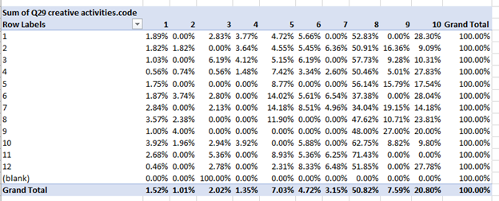
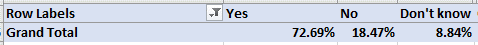
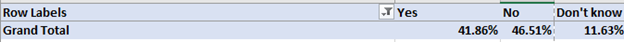

# Greater Hazelwood Community Census data inquiries:
&nbsp;
##### 1. What patterns exist in the gender of the respondent and their perception of Hazelwood's physical appearance? Are folks more likely to be willing to volunteer for a block watch if they believe the neighborhood's appearance is positive?
 
- Per the responses to question 11, women were slightly more likely to have a positive perception of the physical appearance of the neighborhood, with 50.35% ranking it Excellent -Very Good-Good, versus 48.39% of men. Men were slightly more likely to give it the lowest rating of Poor, 22.58% versus 18.79% for women. 

- People were more likely to say they were interested in volunteering for a neighborhood watch if they thought the neighborhood had Excellent or Poor appearance. They were least likely to it they rated the appearance as Very Good.

#### 2. Which subgroup of respondents (sliced on relevant/interesting questions) are most likely to have indiciated interest in a block watch?

-  	I found that the subgroup of respondents aged 45-54 are most likely to say that they were interested in volunteering for block watch.

	

#### 3. Inquire into patterns that exist in respondents ideas for changes to make in Hazelwood (Q6). Would creating sub-planning groups for neighborhood improvements based on age and gender makse sense to you based on the data? Is there a connection between the improvements folks would like to see and the Creative activities folks are interested in (Q29)?
- The most common responses to changes wanted are More Food Stores and Businesses and Other. The More Food Stores answer was common across all age groups, so a sub-planning group wouldn’t need to be separated based on age. The youngest group was more likely to select Violence as a concern, so they may desire to create a group for young adults addressing that. Women seem more likely than men to rank More Food Stores high for all age groups.

	 

- There doesn’t seem to be a large connection between the different answers to Q6 and Q29. The most common answer was more kid activities (column #8 below).

	

#### 4. To what degree are folks who indicate that they have special skills more likely to be willing to volunteer in the community (Q25)?

- 	People who wrote that they had some sort of special skill had the below responses for whether they would volunteer:

- People who wrote No, N/A or a similar variation responded per below, suggesting that people who claim to have special skills are much more likely to be willing to volunteer:

