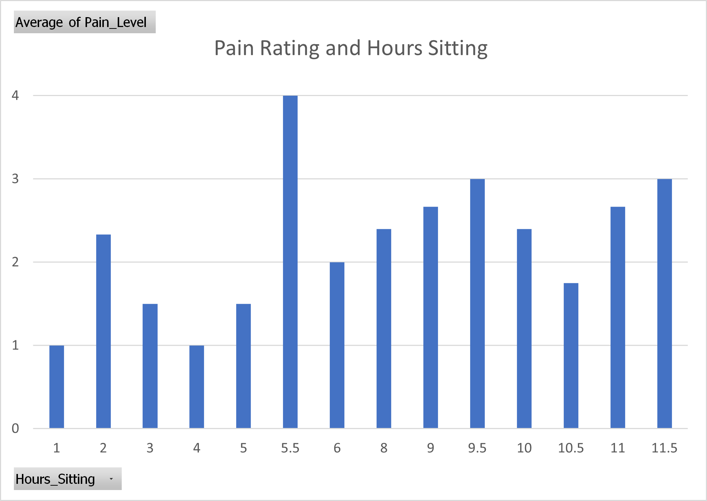

# Visualize Yourself Project Priliminary Charts

After using pivot tables and charts to find patterns, I believe that I have a few possible routes to find correlations. Below are some basic charts that I created that may help me find useful patterns.

&nbsp;

&nbsp;

&nbsp;

