# Visualize Yourself Project
## Analyzing My Neck Pain and the Factors That May Cause It
&nbsp;
For years now I have been experiencing frequent pain in my neck and shoulders. A couple of years ago I went to a physical therapist, and they gave me several exercises to try at home. I stopped going to the therapy because I figured I could just do everything at home, however, I didn't keep up with it very well. I decided to use the Data Visualization class project to make myself do the therapy exercises close to every day and see if the pain improves. I also tracked several other factors to be able to evaluate whether they had an impact on the pain. 

## Methodology

I used a notebook to record my data every day, and then about once a week I transfered the data to an Excel file. I rated my neck pain based on the worst I felt throughout the day. If I rated it a 2 initially and then it felt worse later, I would change to 3 or 4. I made up a scale of how I rated my neck pain:

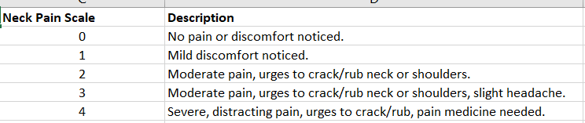

Below is a snippet of my completed data collection:

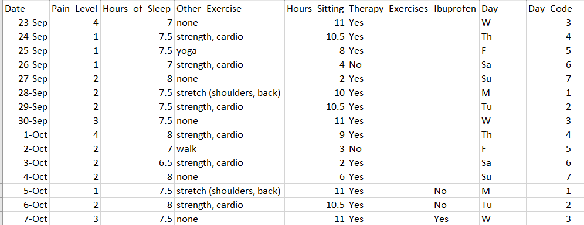

## Results Overall

I used pandas and matplotlib to analyze my project data. At first I wanted to visualize whether my pain levels improved throughout the project. I viualized this with a simple line chart:

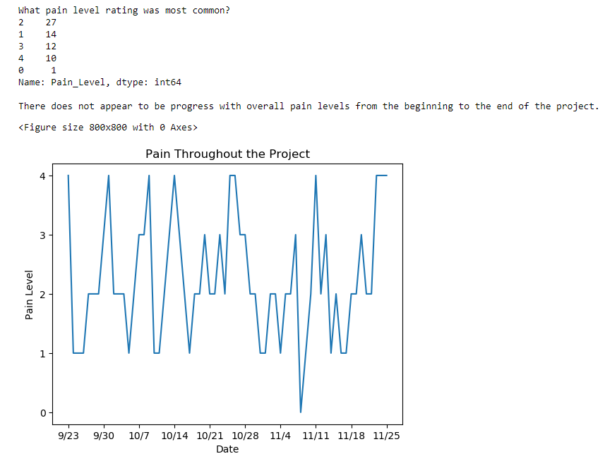

The chart indicates not only that my pain varied a lot throughout the project, but it did not improve overall. 

## Results from isolating days of other exercises

I recorded what type of other exercises I did each day other than my therapy exercises. I wanted to see if the type of exercise may have had an effect on the pain. The two kind I thought might have the largest effects were the strength and cardio days, and the shoulder stretch days. Did the pain increase or decrease the day after these exercises?

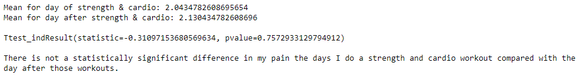
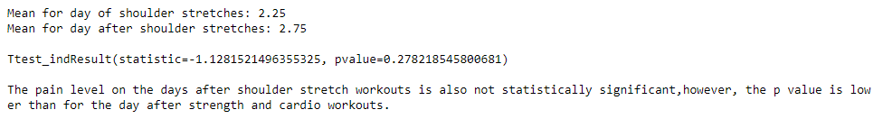

Based on the high p-values, I cannot conclude that the type of exercises performed affected my neck pain the following day.

## Pain Level and Hours Sitting
I next evaluated whether my neck pain was affected by the number of hours I spent sitting in a day. I isolated the days which I rated pain of 3 or 4 as "High Pain Days", and isolated the days rated 2 or less as "Low Pain Days". Then I compared the average hours sitting for each group. The mean hours sitting for high pain days was 8.5, and 6.65 for low pain days. I ran a t-test which resulted in a p-value of 0.029, indicating that there is a statistically significant difference in the mean. I used a box plot to chart the two types of pain level:

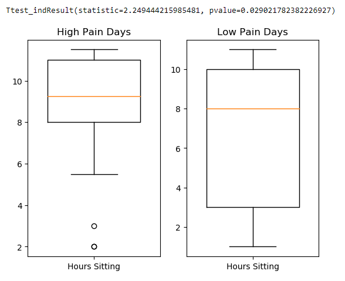

# Did the therapy exercises affect pain?
I also wanted to evaluate whether my pain on the days I performed the therapy exercises differed from the days I did not do the exercises.

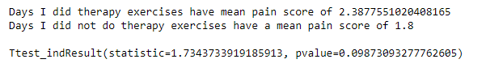

Even though the p-value was too high to indicate a statistically significant difference, the means were different enough to warrant further investigation. However, it seemed unlikely to me that skipping the exercises would actually help reduce pain. I knew I was more likely to skip the exercises on the weekend days than the weekdays. I also rated my pain lower on the weekends and had fewer hours sitting on the weekends. Therefore, I might suspect that the lower pain on days off of doing therapy exercises was more likely due to low sitting hours than due to not completing the exercises.

To demonstrate this I looked into how many hours I sat on therapy days than on days I skipped:

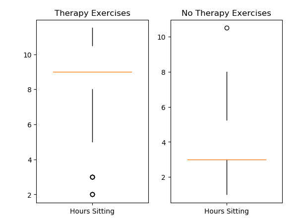

## Pain by days of the week

Given that I suspected sitting was the biggest determination of how I rated my pain, I wanted to check how I rated pain by days of the week, and hours sitting by days of the week. 

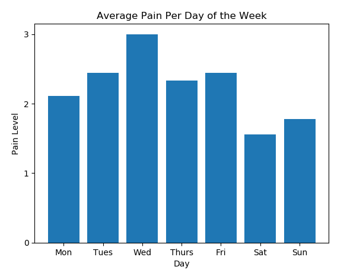
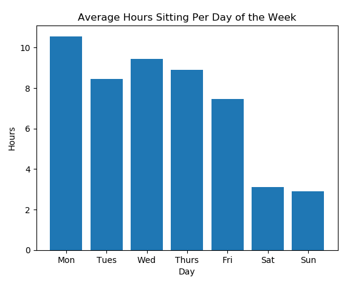

Because both pain and hours sitting are clearly lower on the weekends, I wanted to combine them on a single chart, 

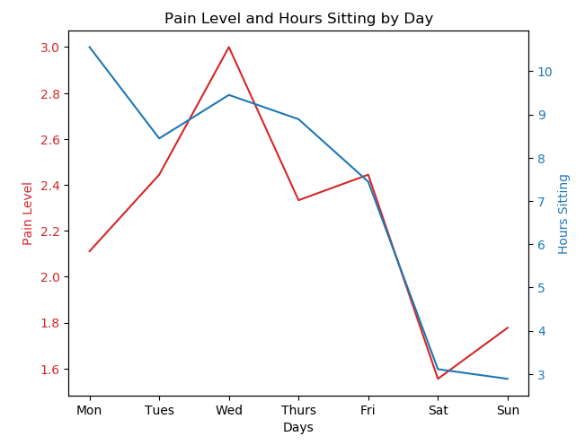

## Conclusions
After looking at several factors that I recorded data for, I believe that the greatest impact on my neck and shoulder pain is not whether I am consistently doing the therapeutic exercises, or what other kinds of exercise I do. The greatest impact is the number of hours I spend sitting. Saturdays and Sundays are low pain days and low sitting days. This may be because my pain is actually lower on these days or that I am just not noticing it as much. However, because Mondays are also relatively low pain days, I suspect the hours sitting may be a cumulative effect. I may benefit from making sure to take a lot of breaks throughout the days to stand up and walk around. 

